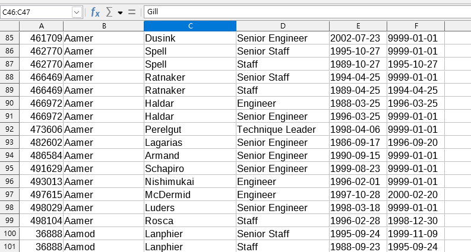
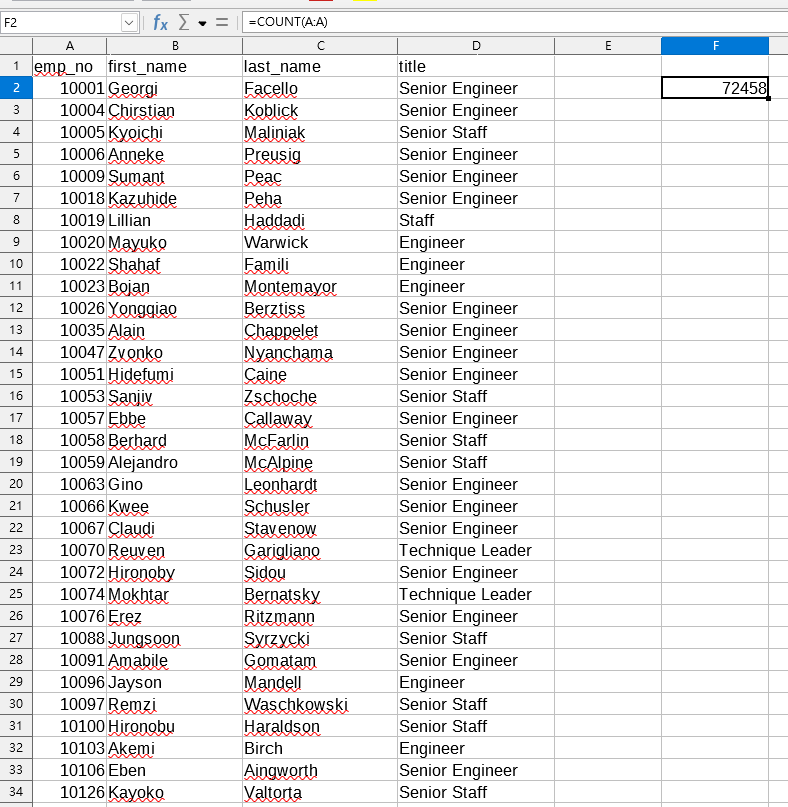
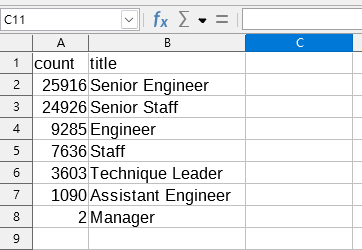
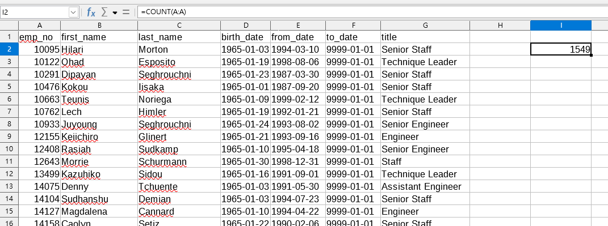
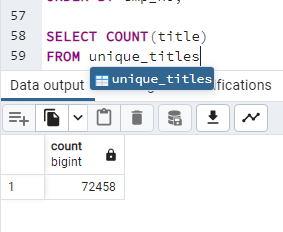
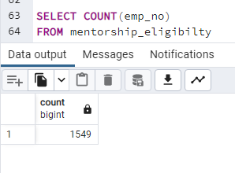

# Pewlett-Hackard-Analysis
## Overview of the analysis:
This analysis is going to help Bobby, who is the HR in Pewlett Hackard, to know how many people will retire in next year and how many job posistion need to be filled.

## Results:
* In retirement_titles.csv we know that most of employees have 2 titles.

* In unique_titles.csv we know that 72458 employees are going to retire in next year.

* In retiring_titles.csv we know that senior engineer will need most people to fill into than other positions.

* In mentorship_eligibilty.csv we know that there are 1549 employees have eligibility.

 

## Summary:
-There are 72458 roles need to be filled when the "silver tsunami" begins.

-Not enough, unless 1 employee is able to mentor 46 employees.

